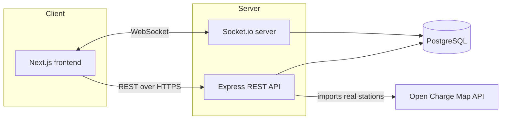
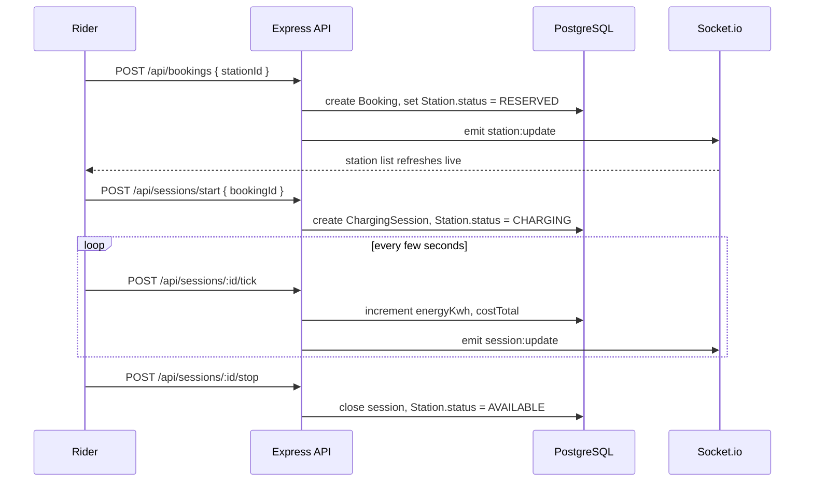

# Voltway — EV Charging Station Management Platform

A full-stack platform connecting EV riders, charging station operators, and administrators through a
single system: live station discovery for cars and two-wheelers, one-tap booking, real-time
charging-session tracking, and role-based dashboards.

Built as a portfolio project to demonstrate practical full-stack engineering: a normalized relational
data model, JWT-secured REST APIs, WebSocket-driven real-time state, and integration with a real
third-party data source.

## Live data, honestly described

- **Car charging stations** are pulled from [Open Charge Map](https://openchargemap.org) — a free,
  community-maintained, global database of real charging locations. Operators trigger an import for
  any city from their dashboard.
- **Two-wheeler charging stations** are seeded by hand. No public API currently tracks two-wheeler
  charging infrastructure (a genuine gap in the EV data ecosystem, especially in markets like India
  where two-wheeler EVs are a large share of the market) — so this segment is modeled directly in the
  platform's own database, the same way a real operator network would be onboarded.
- **Bookings and charging sessions** are always the platform's own data — no public API for this
  exists anywhere, since it requires a live relationship between a rider, a specific charger, and a
  payment/session record.

## Features

- 🔎 **Nearby station search** for both cars and bikes, with connector-type and brand compatibility
  shown per station (CCS2, CHAdeMO, Type 2, Bharat AC001)
- 📅 **Booking flow** — reserve an available charger, then start a session once you arrive
- ⚡ **Real-time charging session tracking** — live energy delivered (kWh) and running cost, pushed
  over Socket.io
- 🧑‍🤝‍🧑 **Role-based dashboards** — separate experiences for riders, station operators, and admins,
  each behind JWT + role-checked middleware
- 🛠️ **Operator tools** — manage station status, import real stations from Open Charge Map
- 📊 **Admin overview** — network-wide station and session counts, user directory

## Tech stack

| Layer | Choice | Why |
|---|---|---|
| Frontend | Next.js 15 (App Router) + TypeScript + Tailwind CSS | Modern React framework, strong hiring signal, fast styling |
| Backend | Node.js + Express + TypeScript | The most widely expected fresher/junior stack |
| Database | PostgreSQL + Prisma ORM | Relational data (bookings ↔ stations ↔ sessions) modeled properly, type-safe queries |
| Real-time | Socket.io | Live station status and session updates without polling |
| Auth | JWT + bcrypt | Stateless auth with role-based access control |
| Data fetching | TanStack Query | Caching, refetching, and mutation state on the frontend |
| Validation | Zod | Runtime request validation shared between schema and types |
| Maps | React-Leaflet + OpenStreetMap | No API key required, fully open-source |
| Infra | Docker Compose (local Postgres), GitHub Actions CI | Reproducible local dev, automated lint/build checks |

## Architecture



Request flow for one core feature — booking and charging a station:



## Project structure

```
ev-charging-platform/
├── backend/            Express + TypeScript API, Prisma schema, Socket.io
├── frontend/           Next.js App Router client
├── docker-compose.yml  Local PostgreSQL for development
└── .github/workflows/  CI: lint + build on every push
```

## Getting started

### Prerequisites
- Node.js 20+
- Docker (for local PostgreSQL) — or your own Postgres instance

### 1. Clone and install

```bash
git clone <your-fork-url> ev-charging-platform
cd ev-charging-platform
cd backend && npm install
cd ../frontend && npm install
```

### 2. Start PostgreSQL

```bash
docker compose up -d
```

### 3. Configure environment variables

```bash
cp backend/.env.example backend/.env
cp frontend/.env.example frontend/.env.local
```

The defaults in `backend/.env.example` already match `docker-compose.yml`, so no edits are required
for local development. Set a real `JWT_SECRET` before deploying anywhere public.

### 4. Set up the database

```bash
cd backend
npx prisma generate
npx prisma migrate dev --name init
npx prisma db seed
```

This creates three demo accounts (password for all: `password123`):

| Role | Email |
|---|---|
| Rider | `rider@voltway.app` |
| Operator | `operator@voltway.app` |
| Admin | `admin@voltway.app` |

### 5. Run both apps

```bash
# terminal 1
cd backend && npm run dev

# terminal 2
cd frontend && npm run dev
```

Visit `http://localhost:3000`, log in as the operator, and use **Import nearby stations** on the
operator dashboard to pull real charging stations for your city from Open Charge Map before logging
in as the rider to browse them.

## Push this to your own GitHub

```bash
cd ev-charging-platform
git init
git add .
git commit -m "Initial commit: EV charging station management platform"
git branch -M main
git remote add origin https://github.com/<your-username>/<your-repo-name>.git
git push -u origin main
```

Create the empty repo on GitHub first (no README/license, to avoid a merge conflict), then run the
commands above from inside this project folder.

## Deployment

This is set up to deploy for free on **Vercel** (frontend) + **Render** (backend + PostgreSQL).

### Backend on Render
1. Push this repo to GitHub.
2. In Render, create a **PostgreSQL** instance and copy its connection string.
3. Create a **Web Service** pointing at the `backend/` directory, using the included `Dockerfile`.
4. Set environment variables: `DATABASE_URL` (from step 2), `JWT_SECRET` (generate a long random
   string), `CORS_ORIGIN` (your Vercel URL, added after step below).
5. Deploy. Render runs `prisma migrate deploy` automatically via the Dockerfile's start command —
   run `npx prisma db seed` once from the Render shell to create demo accounts.

### Frontend on Vercel
1. Import the repo into Vercel, set the project root to `frontend/`.
2. Set `NEXT_PUBLIC_API_URL` to your Render backend's public URL.
3. Deploy, then update `CORS_ORIGIN` on the backend to match your live Vercel URL.

## API overview

All endpoints are under `/api`. Protected routes require `Authorization: Bearer <token>`.

| Method | Route | Description |
|---|---|---|
| POST | `/auth/register`, `/auth/login` | Create an account / log in |
| GET | `/stations/nearby?lat&lng&vehicleType` | Search stations by distance |
| POST | `/stations/import/open-charge-map` | Operator: import real stations |
| PATCH | `/stations/:id/status` | Operator: update station status |
| POST | `/bookings`, `/bookings/:id/cancel` | Rider: reserve / cancel a charger |
| POST | `/sessions/start`, `/sessions/:id/tick`, `/sessions/:id/stop` | Rider: run a charging session |
| GET | `/users/stats/overview` | Admin: platform-wide metrics |

## Known limitations & possible next steps

- Nearby-station search uses an in-memory Haversine calculation rather than a PostGIS spatial index —
  fine at this data scale, worth revisiting if station counts grow into the tens of thousands.
- Charging-session energy delivery is simulated on the client via a `tick` endpoint, standing in for
  real charger telemetry — a production deployment would replace this with a hardware/OCPP integration.
- No payment integration yet; `costTotal` is calculated but not charged anywhere.
- No automated test suite yet — a good next addition (Vitest/Jest + Supertest for the API,
  Playwright for the frontend).

## Credits

Station location data © [OpenStreetMap](https://www.openstreetmap.org/copyright) contributors, via
[Open Charge Map](https://openchargemap.org).
